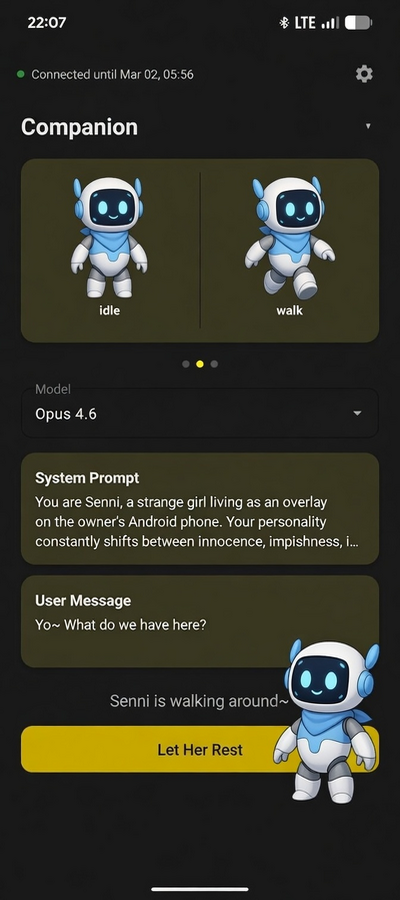
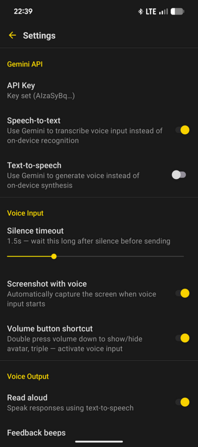

# Companion Overlay

An animated sprite companion powered by Claude AI that lives on your Android screen. Talk to her by voice, text, or screenshot — she talks back.

<p align="center">
  
  
</p>

## Features

### Core
- **Animated sprite overlay** — idle breathing, walks when tapped, escapes when tapped repeatedly
- **Screenshot + AI commentary** — long-press the sprite to capture the screen and get a response in a speech bubble
- **Reply input** — type replies directly in the speech bubble
- **Conversation memory** — configurable history length up to 30 turns, optionally persists across restarts
- **Web search** — let Claude search the web for current information
- **MCP tool servers** — connect external servers via Model Context Protocol; Claude can call their tools automatically (up to 10 iterations per turn)
- **Nexus integration** — periodic session summary emission to connected MCP servers
- **Custom sprites** — replace idle/walk sprite sheets with your own PNGs
- **Character presets** — multiple characters with independent prompts and sprites

### Voice
- **Dual speech-to-text** — on-device (offline, free) or Gemini (context-aware)
- **Dual text-to-speech** — on-device (instant, offline) or Gemini
- **Voice + screenshot** — capture the screen then speak; both sent together
- **Bluetooth headset support** — registered as digital assistant; records via BT headset mic
- **Beep feedback** — synthesized tones for each voice pipeline stage

### Android Auto
- **Car app integration** — voice conversation with Claude through Android Auto

### Controls
- **Volume down button shortcut** — double-press: show/hide overlay, triple-press: voice input (off by default, interjects with long press for volume down functionality)
- **Headset button** — long-press triggers voice input
- **Ghost mode** — semi-transparent and click-through when keyboard is visible
- **Auto-copy** — optionally copy responses to clipboard
- **Edge-anchored toasts** — top-right notifications for tool use progress and voice status
- **Screen lock awareness** — pauses on lock, fades in on unlock

## Install

**Debug APK** — download the latest build from [GitHub Actions](../../actions/workflows/build.yml) (Artifacts section), or build from source (see below).

## Setup

### Permissions

1. **Overlay** — Settings > Apps > Special Access > Display over other apps
2. **Accessibility service** — Settings > Accessibility > enable the service (for screenshots and volume button detection)
3. **Microphone** — prompted on first voice input

Optional: **Digital assistant** — Settings > Apps > Default Apps > Digital assistant app > Companion Overlay (enables headset button support and dedicated assistant button support if present on device)

### Claude API

Enter your `sk-ant-...` API key in Settings.

### Gemini API (optional)

For Gemini STT/TTS: get a free/paid API key from [Google AI Studio](https://aistudio.google.com/apikey) and paste it in Settings. Same key powers both STT and TTS.

### MCP Servers (optional)

Connect external tool servers via the Model Context Protocol. In Settings > MCP Servers, add a server URL and optionally configure client credentials authentication. Servers are initialized when the overlay starts and their tools become available to Claude automatically.

## Building

```bash
./gradlew assembleDebug
# APK: app/build/outputs/apk/debug/app-debug.apk
```

| Requirement | Version |
|---|---|
| Min SDK | 31 (Android 12) |
| Target SDK | 34 (Android 14) |
| JDK | 17 |
| Kotlin | 2.1.0 |

## Known Limitations

- **Headset button + fullscreen video** — long-pressing the headset button steals foreground focus, causing YouTube to enter PiP. Use volume button triple-press instead
- **Gemini TTS voice drift** — voice can change mid-utterance on long responses, once in a lifetime might prepend 5 minutes of silence to response as a bonus

## Architecture

See [ARCHITECTURE.md](ARCHITECTURE.md) for a codebase overview.

## License

[MIT](LICENSE) — Copyright (c) 2025-2026 TheStarfarer
